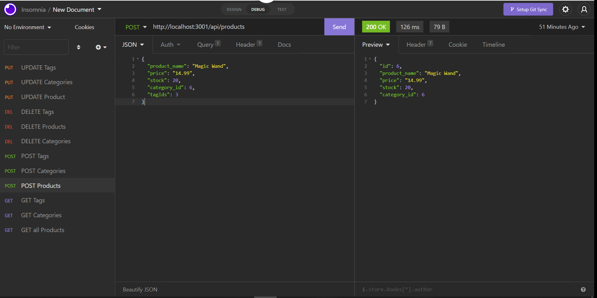

# E-Store Database
## Description
  
- Why did I build this project? To create useable routes for a ecommerce website server
- What problem does it solve? Allows for employees to keep track of inventory, categories, and tags
- What did I learn? To utilize models and sequelize to create more efficient databases
  
## Table of Contents (Optional)
  
- [Installation](#installation)
- [Usage](#usage)
- [Credits](#credits)
- [License](#license)
- [Questions](#questions)
  
## Installation

Download zip or git clone from my repo on github

## Usage
  
Log in to mysql and use as source db/schema.sql and run the server

Add a screenshot here:
  
"
  
## Credits
  
Collaborators: None 
  
## License
  
Unlicensed

  
## Questions
  
All questions and communications can be directed to:
Github: github.com/frivera14 
